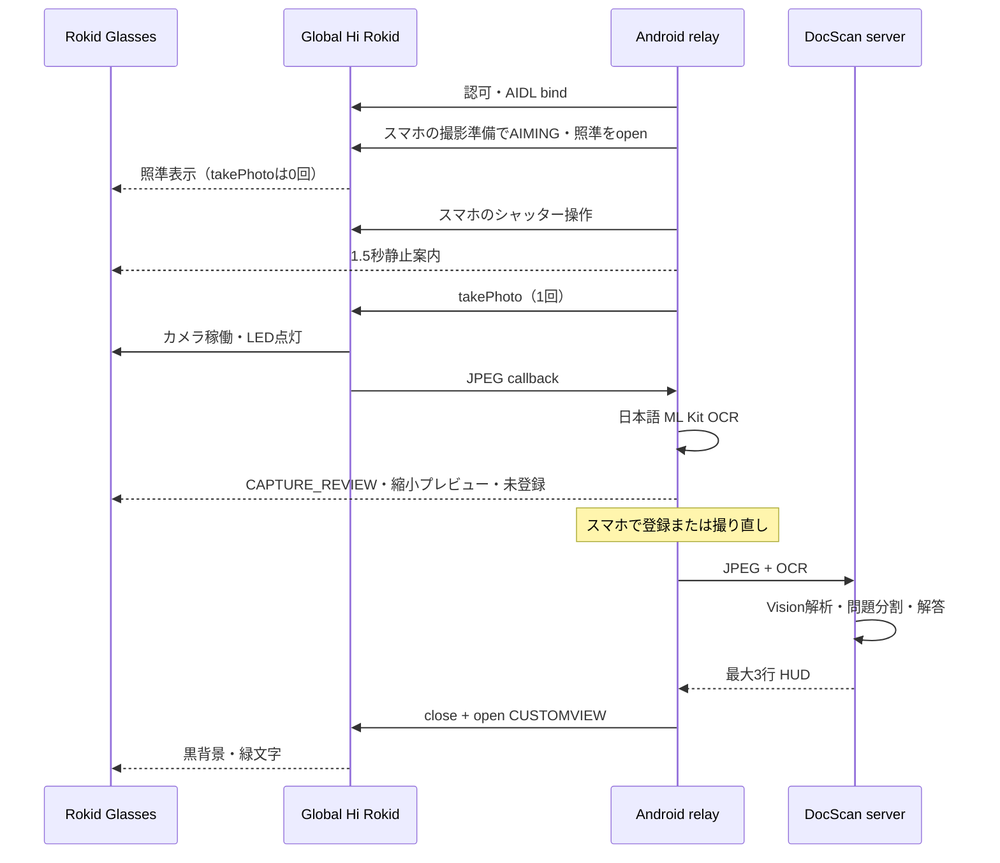

# CXR-L / Global Hi Rokid integration

この文書は、`android-relay` に入っている実装の契約を説明します。Windows と
Android スマホを使う導入手順は
[windows-android-real-device-setup.md](windows-android-real-device-setup.md)
を正本としてください。

対象は Android client `0.3.16`、Glasses View contract `1.10.0` です。

## 結論

`TakanariShimbo/CxrGlobal` 自体は vendoring、submodule、ソースコピーのいずれでも
取り込んでいません。代わりに次の形で、必要な Global 化をこのリポジトリ内に実装して
います。

- `android-relay` が Rokid 公式 AAR
  `com.rokid.cxr:client-l:1.1.1` を Rokid Maven から取得する。
- AAR に含まれる公開 AIDL 型を使う。
- `RokidGlobalLink` が Global Hi Rokid
  `com.rokid.sprite.global.aiapp` の認可 Activity と
  `IMediaStreamService` へ接続する。
- Rokid の AAR バイナリはリポジトリへコピーしない。

したがって、Windows 側で別途 CxrGlobal を clone する必要はありません。ただし、公式
AAR の取得には初回ビルド時のインターネット接続が必要です。

## 実装済みの接続面

| 機能 | 使用する CXR-L 面 | リポジトリ内実装 |
|---|---|---|
| Hi Rokid 認可 | `AUTHORIZATION` Activity、`auth_token` | `RokidGlobalLink.authorizationIntent` |
| サービス接続 | `MEDIA_STREAM_SERVICE`、`auth_token`、`auth_package` | `RokidGlobalLink.connect` |
| グラス接続状態 | `IDeviceStatusCallback` | `onGlassesConnected` |
| 写真撮影 | `takePhoto`、`IImageStreamCallback` | `takePhoto` / `onImageReceived` |
| HUD | `openCustomView` / `closeCustomView` | `showHud` / `HudLayout` |
| CUSTOMVIEW lifecycle | `onCustomViewOpened` / `onCustomViewClosed` / `IAiEventCallback` | 表示ACK・診断ログのみ。操作入力には使わない |

Action 文字列と Global パッケージ名は `RokidGlobalLink` の一か所に隔離しています。
Hi Rokid または YodaOS 更新後は、この値とコールバックを実機で再検証してください。

## データフロー

## 操作入力の境界

公開CXR-Lから専用シャッターボタンや全タッチジェスチャを取得できるとは仮定しません。
Hi Rokid `G1.12.10.0815` / CXR-L service `1.0.0 code 10000` の17分間の追試では、
CUSTOMVIEW上のoperator tapと時刻が一致するcallbackを確認できませんでした。
`onCustomViewClosed`、`AI-exit`、AI key callbackは、表示lifecycleや診断上の事象として
記録するだけで、撮影、取消、登録、読取完了、画面送りへ変換しません。

現行の正規操作面はスマホです。撮影準備、シャッター、取消、写真登録、撮り直し、
読取完了、レビュー移動、新規文書をスマホの明示ボタンで行います。CUSTOMVIEWの
open ACKを得るまでは撮影タイマーを開始せず、ACK error/timeoutでは撮影を中止して
callback epochをfenceします。

## CUSTOMVIEW

`customViewUpdate` が成功を返しても表示が更新されない Global ビルドがあります。
リレーは黒背景の View をいったん閉じ、同じ View を再度開く方法を既定にしています。
白い中間フレームやアニメーション指示は生成しません。

close/openとAI eventは世代つきのCustomView lifecycleとして記録し、どのcallbackも
ユーザー操作へ変換しません。
撮影ガイドは要求世代のopen callbackとremote openの両方を確認するまで未確認とします。
非同期errorまたは3秒のACK timeoutでは準備を取り消して`takePhoto`を発行せず、
そのcallback epochをfenceします。「Hi Rokid認可・再接続」で新しいbindとcallback epochを
確立するまで、次のCustomView要求を発行しません。

撮影後は、JPEGを縮小・回転したプレビューと確認操作を正しいCustomViewとして
グラスへ表示し、スマホにも同じ写真を表示します。これは撮影済み写真の確認です。
`client-l:1.0.1` の公開静止画API面には撮影前ライブ映像とオートフォーカスのAPIが
ないため、ライブファインダーや合焦状態は表示しません。`AIMING` の照準は構図合わせ用です。

## 写真・OCR・解答

写真は互換入力ではなく、実機の主入力です。

1. スマホの「撮影準備」で `AIMING` に入り、照準を表示する。この時点では `takePhoto` を
   発行しない。
2. 照準確認後、スマホのシャッター操作で静止案内を要求し、その世代のopen callback確認後から
   1.5秒の静止時間を取り、その後 `takePhoto(1920, 1080, 80)` を1回だけ発行して
   JPEGを受け取る。`AIMING` と静止待ちの取消はスマホの「撮影取消」で行う。
3. Android 上の bundled Japanese ML Kit で OCR する。
4. JPEG と OCR をスマホ内の `CAPTURE_REVIEW` に保持し、未登録の写真として
   スマホとグラスの縮小プレビューで用紙の四隅、文字の輪郭、OCR文字数を確認する。
   初回撮影前に文書自体は作成するが、対象ページと次ページ番号は変更しない。
5. スマホの「この写真を登録」で明示確定してから、元 JPEG、ML Kit と同じ回転角、
   OCR を `/v1/documents/{id}/pages` へ送り、
   サーバーで OCR と同じ向きの PNG に正規化する。
6. `ROKID_ANALYZER=openai|gemini|claude` の画像対応 Analyzer が、必要に
   応じて画像から完全な転記と図表説明を生成する。
7. `finalize-reading` が問題を分割し、開始ページ画像を画像対応 Solver へ渡す。
8. `/review` の3行表示を CUSTOMVIEW へ送る。

端末 OCR が0文字の場合は警告し、明示登録または撮り直しを選びます。
スマホの「同じページを撮り直す」は、サーバーへ送らず同じ `page_index` の
`AIMING` へ戻します。スマホの次のシャッター操作まで再撮影しません。
「未登録写真を破棄」は保留写真を送信せず読取へ戻します。登録要求が成功するまで、
対象ページと次ページ番号は変わりません。
未登録JPEG、OCR、ページ番号、回転はアプリ専用領域へ保存し、アプリ再起動後も
`CAPTURE_REVIEW` に復元します。復元や状態遷移だけで自動撮影・自動登録することは
ありません。

写真回転の既定は実機に合わせた90°です。スマホで0/90/180/270°を選んだ場合、
その値は「同じページを撮り直す」で撮る次の写真へ適用し、現在の保留写真は変更しません。
画像対応 Analyzer が未設定のまま確定して問題を検出できなかった場合は、セッションを
読取状態に戻します。ページを再撮影するか Analyzer を設定してから、同じページ番号を
置換して再度読取完了を実行できます。

運用開始値として用紙まで40〜60cm離し、用紙中心を照準の「＋」へ合わせ、スマホの
シャッター操作からcallbackまで静止します。この距離は合焦保証ではありません。
ディスプレイFOVとカメラFOVが異なるため、
照準は正確な撮影境界ではなく、四隅は撮影後プレビューで確認します。公開APIから
フォーカス位置や合焦完了は取得できません。
12MPセンサーの公称解像度はCXR-L callbackの安全な転送サイズを意味しません。
実機では `takePhoto(4032, 3024, 80)` でcallbackを得られませんでした。Binder圧迫は
仮説であり根本原因は未確定なので、検証済みの `1920x1080 q80` から開始します。

### 撮影リースとタイムアウト

検査した `client-l:1.1.1` の公開 `IMediaStreamService` は静止画について `takePhoto` と
`IImageStreamCallback` を提供しますが、撮影キャンセル／camera close API は公開して
いません。そのため、30秒のwatchdog満了を「カメラ停止」とは扱いません。

- 必須callbackの登録が1つでも失敗した接続では撮影しない。
- `takePhoto` は同時に1件だけ許可する。
- Binder例外で `takePhoto` の受理結果を確認できない場合も、撮影中の可能性があるため
  即時に安全停止し、遅延callbackまたはCXR-L service bindingの再作成まで次の操作を
  許可しない。
- 正常画像または明示的な画像エラーcallbackで撮影リースを解放する。
- タイムアウト後は、遅延callbackまたは実際のservice unbind/rebindを確認するまで、
  再撮影・読取完了・新規文書・設定変更を拒否する。グラスの接続状態callbackだけでは
  同じbindから遅延画像が届き得るため、リースを解放しない。
- タイムアウト後に届いた画像は、古い撮影か判別できないためアップロードせず破棄する。
- callbackはAIDL bindごとのepochに属する。切断・再接続前のbindから遅れて配送された
  callbackは、新しい撮影リースを完了せず、画像もアップロードしない。

これにより、前のカメラ状態が不明なまま次の撮影を重ねてLED点灯時間を延ばすことを防ぎます。

## 公開 API から確認できないもの

次の機能を実装済みとは扱いません。

- グラス搭載 GPT/Gemini の任意の認識文を外部アプリへ返すコールバック
- グラス搭載 AI の任意の回答を CXR-L から直接取り出すコールバック
- 全タッチジェスチャの AIDL 配送
- 撮影前ライブカメラ映像、オートフォーカス制御、合焦状態
- 専用シャッターボタンの入力イベント
- 全 Global Hi Rokid / YodaOS バージョンで同一の再描画動作

これらが将来公開 SDK に追加された場合は、現行の写真・サーバー解析経路を残したまま
別 Adapter として追加してください。

## LED

LED はハードウェア/ファームウェア制御です。対応コードは無効化、遮蔽、偽装、回避を
行いません。点灯時間を短くする手段は、撮影要求を1件に限定し、callback後に追加の
camera要求を出さず、timeout時に状態不明として再接続を要求することです。
ビルド成功だけでは確認にならないため、実機で「撮影中に点灯」「画像 callback 後に消灯」
「解答閲覧中は消灯したまま」を物理確認してください。シャッター音、フラッシュ、撮影表示も
公開 SDK で制御できると仮定せず、使用ファームウェアで実測します。

旧実験用LED utilityはサポート対象外で、Android relay、通常UI、Intent、HTTP API、
環境変数から到達できません。

## 参考

- [TakanariShimbo/CxrGlobal](https://github.com/TakanariShimbo/CxrGlobal)
- [Android relay README](../android-relay/README.md)
- [Windows + Android 実機手順](windows-android-real-device-setup.md)
