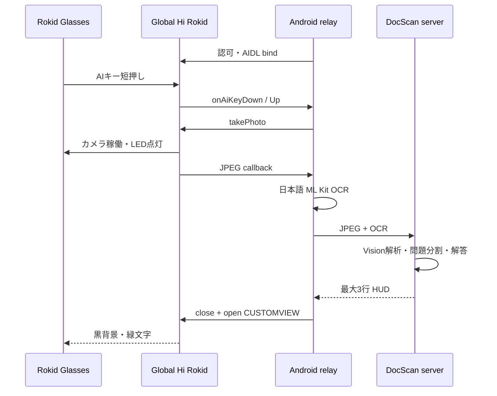

# CXR-L / Global Hi Rokid integration

この文書は、`android-relay` に入っている実装の契約を説明します。Windows と
Android スマホを使う導入手順は
[windows-android-real-device-setup.md](windows-android-real-device-setup.md)
を正本としてください。

## 結論

`TakanariShimbo/CxrGlobal` 自体は vendoring、submodule、ソースコピーのいずれでも
取り込んでいません。代わりに次の形で、必要な Global 化をこのリポジトリ内に実装して
います。

- `android-relay` が Rokid 公式 AAR
  `com.rokid.cxr:client-l:1.0.1` を Rokid Maven から取得する。
- AAR に含まれる公開 AIDL 型を使う。
- `RokidGlobalLink` が Global Hi Rokid
  `com.rokid.sprite.global.aiapp` の認可 Activity と
  `IMediaStreamService` へ接続する。
- Rokid の AAR バイナリはリポジトリへコピーしない。

したがって、Windows 側で別途 CxrGlobal を clone する必要はありません。ただし、公式
AAR の取得には初回ビルド時のインターネット接続が必要です。

## 実装済みの接続面

| 機能 | 使用する CXR-L 面 | リポジトリ内実装 |
|---|---|---|
| Hi Rokid 認可 | `AUTHORIZATION` Activity、`auth_token` | `RokidGlobalLink.authorizationIntent` |
| サービス接続 | `MEDIA_STREAM_SERVICE`、`auth_token`、`auth_package` | `RokidGlobalLink.connect` |
| グラス接続状態 | `IDeviceStatusCallback` | `onGlassesConnected` |
| 写真撮影 | `takePhoto`、`IImageStreamCallback` | `takePhoto` / `onImageReceived` |
| HUD | `openCustomView` / `closeCustomView` | `showHud` / `HudLayout` |
| グラス入力 | `IAiEventCallback.onAiKeyDown/Up` | `PressGestureInterpreter` |

Action 文字列と Global パッケージ名は `RokidGlobalLink` の一か所に隔離しています。
Hi Rokid または YodaOS 更新後は、この値とコールバックを実機で再検証してください。

## データフロー

## グラス入力

公開 AIDL で利用するのは AI キーの down/up です。全タッチジェスチャを取得できるとは
仮定しません。

| AIキー操作 | 読取中 | 閲覧中 |
|---|---|---|
| 短押し | 次ページを撮影 | 次の表示 |
| 短押し2回 | 前ページを再撮影 | 前の表示 |
| 長押し | 読取完了・解析開始 | 閲覧終了・新規文書 |

スマホ画面のボタンにも同じ操作を置いているため、入力イベントに端末差がある場合でも
診断と復旧ができます。

## CUSTOMVIEW

`customViewUpdate` が成功を返しても表示が更新されない Global ビルドがあります。
リレーは黒背景の View をいったん閉じ、同じ View を再度開く方法を既定にしています。
白い中間フレームやアニメーション指示は生成しません。

## 写真・OCR・解答

写真は互換入力ではなく、実機の主入力です。

1. `takePhoto(1440, 1920, 85)` で JPEG を受け取る。
2. Android 上の bundled Japanese ML Kit で OCR する。
3. 元 JPEG、ML Kit と同じ回転角、OCR を `/v1/documents/{id}/pages` へ送り、
   サーバーで OCR と同じ向きの PNG に正規化する。
4. `ROKID_ANALYZER=openai|gemini|claude` の画像対応 Analyzer が、必要に
   応じて画像から完全な転記と図表説明を生成する。
5. `finalize-reading` が問題を分割し、開始ページ画像を画像対応 Solver へ渡す。
6. `/review` の3行表示を CUSTOMVIEW へ送る。

端末 OCR が空でも JPEG は保存されます。画像対応 Analyzer が未設定のまま確定して
問題を検出できなかった場合は、セッションを読取状態に戻します。ページを再撮影するか
Analyzer を設定してから、同じページ番号を置換して再度読取完了を実行できます。

## 公開 API から確認できないもの

次の機能を実装済みとは扱いません。

- グラス搭載 GPT/Gemini の任意の認識文を外部アプリへ返すコールバック
- グラス搭載 AI の任意の回答を CXR-L から直接取り出すコールバック
- 全タッチジェスチャの AIDL 配送
- 全 Global Hi Rokid / YodaOS バージョンで同一の再描画動作

これらが将来公開 SDK に追加された場合は、現行の写真・サーバー解析経路を残したまま
別 Adapter として追加してください。

## プライバシー LED

LED はハードウェア/ファームウェア制御です。アプリは無効化・迂回・偽装しません。
ビルド成功だけでは確認にならないため、実機で「撮影中に点灯」「画像 callback 後に消灯」
「解答閲覧中は消灯したまま」を物理確認してください。シャッター音、フラッシュ、撮影表示も
公開 SDK で制御できると仮定せず、使用ファームウェアで実測します。

## 参考

- [TakanariShimbo/CxrGlobal](https://github.com/TakanariShimbo/CxrGlobal)
- [Android relay README](../android-relay/README.md)
- [Windows + Android 実機手順](windows-android-real-device-setup.md)
